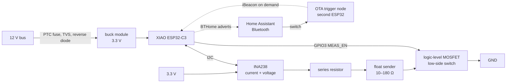

# 🚤 wireless-tank-sensor

[](https://github.com/eburi/wireless-tank-sensor/actions/workflows/build.yml)
[](LICENSE)
[](https://esphome.io/components/external_components/)
[](https://bthome.io/)
[](https://www.home-assistant.io/integrations/bthome/)
[](https://wiki.seeedstudio.com/XIAO_ESP32C3_Getting_Started/)
[](#-updating-firmware-without-touching-the-thing)
[](#-hardware)
[](#-the-backstory)
[](https://github.com/eburi/wireless-tank-sensor/commits/main)
[](https://github.com/eburi/wireless-tank-sensor/pulls)
[](https://github.com/eburi/wireless-tank-sensor/stargazers)

A sealed, potted, maintenance-free **water tank level sensor** for boats (or caravans,
cabins, anything with a resistive tank sender and a 12 V bus). It runs on a
**Seeed XIAO ESP32-C3**, measures the plain old resistive float sender, works out the
level itself, and shouts the result at **Home Assistant** over **Bluetooth (BTHome v2)**.

You run **two wires** (12 V and ground) to the tank. That's it. No gauge, no Wi-Fi at
the tank, no app, no cloud. Everything else happens in the Home Assistant box you
already have on board.

> **TL;DR** — three ESPHome [external components](https://esphome.io/components/external_components/)
> (`bthome_beacon`, `tank_level`, `ota_beacon`) plus ready-to-copy example configs.
> Read on for the story, the wiring, and the lessons that cost me a night of sleep.

---

## 🧭 The backstory

When I bought the boat, she came with a set of tank sensors and a very confident
ship's manual. What she did *not* come with were the **analog gauges** those sensors
once fed — a previous owner had removed them at some point in the last geological era,
leaving behind a few dangling wires, a hole in the panel, and a gap in my
understanding of how much fresh water was actually left.

So for the first seasons the "fresh water level" was determined by a highly advanced
algorithm: *the pump starts sounding sad → tank is empty*. This works, in the sense
that a smoke alarm "works" as an oven timer.

Eventually I ripped out the corroded old senders and dropped in **cheap standard
resistive float senders** (~10 Ω to ~180 Ω, the kind every chandlery sells for the
price of a round of drinks). Then came the question: what to connect them to? Buying
new analog gauges felt like installing a fax machine. Buying a "smart" marine tank
monitor felt like paying for a fax machine with a subscription.

Meanwhile there was already a **Home Assistant** box on board, quietly collecting
temperatures, battery voltages and GPS fixes. It has Bluetooth. Bluetooth reaches the
tank locker. You can see where this is going.

The result is this repo: a tiny board that sits by the tank, needs only 12 V, sleeps
almost all the time, wakes up every ten seconds to measure the sender, and broadcasts
the level as a BTHome advertisement. Home Assistant picks it up like any other BTHome
gadget — no pairing, no integration to install, no IP address. The Wi-Fi radio is
switched off and only wakes for firmware updates, because on a boat the Wi-Fi is the
first thing you turn off to save power.

Now the fresh water tank shows up on the dashboard next to the batteries, the "tank
almost empty" sensor can nag me on my phone, and the pump has stopped sounding sad
unexpectedly. Mostly.

---

## ✨ What it does

| | |
|---|---|
| 📡 **BTHome v2 over BLE** | Home Assistant auto-discovers the sensor. Level (%), volume (L), raw sender resistance (Ω) and an *almost empty* problem flag, all in one 31-byte advertisement. |
| 😴 **Deep sleep duty cycle** | Wake → power the measurement chain → sample for ~2.5 s → advertise → sleep 10 s. The sender, the INA238 and its LED are completely unpowered in between. |
| 🧠 **Self-calibrating** | Learns the sender's real min/max resistance from the tank being filled and drained. Conservative: a new extreme needs five spaced observations, the least extreme one wins, the range never shrinks, spikes decay. Persisted to flash. |
| 🪣 **Tank content model** | Float senders have a dead zone at the bottom. Tell it total litres and how many litres the pump still delivers after the gauge reads 0 %, and it reports true content + a "you are now drinking the reserve" flag. Both numbers are editable in HA and stored on the device. |
| 🔒 **Wi-Fi off by default** | Turned on only in a 5-minute *maintenance window*: after a power cycle, or on request via a BLE trigger. If the boat Wi-Fi is gone, the node opens a fallback access point with a captive portal instead. |
| 🛰️ **BLE-triggered OTA** | A second ESP32 by the HA box advertises an iBeacon on demand (an HA switch). The sleeping sensor hears it on its next wake, opens Wi-Fi, and you flash it from the ESPHome dashboard. Potted in resin? Doesn't matter. |
| 🧱 **Fleet friendly** | One shared package, one ten-line file per tank, per-tank OTA targets, one API key for all. |
| 🔌 **Two wires** | 12 V in. Level out, through the air. |

---

## 🏗️ How it works



The sender is just a variable resistor. The ESP switches a small current through it,
the INA238 measures that current and the voltage across the sender, and
`R = V / I`. No dependence on the supply rail, no dependence on the series resistor,
no ADC calibration. The `tank_level` component turns resistance into a percentage
using what it has learned about *your* sender, and `bthome_beacon` packs it into a
BTHome advertisement.

Because the node only listens for the OTA trigger while it is awake anyway, the
trigger costs nothing extra in power, and because it is a standard iBeacon frame
Home Assistant's iBeacon integration even shows the trigger as "present" while it is
on air — free proof the transmitter is transmitting.

---

## 🔩 Hardware

Two ways to build it. Both run the same firmware and the same example configs.

### Rev 3 — the carrier PCB (recommended)

A **55 × 52 mm four-layer carrier** in [hardware/kali-tank-sensor-v3/](hardware/kali-tank-sensor-v3/):
KiCad 10 project, DRC/ERC clean, gerbers, drill files, pick-and-place and BOM, ready for
a PCBWay-style order with SMT assembly. The XIAO and the buck module are hand-soldered
on top afterwards; four wire pads with strain-relief holes take the harness. See
[FABRICATION.md](hardware/kali-tank-sensor-v3/FABRICATION.md) for the order parameters,
assembly order and the things to check before first power-up.

| Part | Role | Approx. cost |
|------|------|-------------:|
| Seeed **XIAO ESP32-C3** + its **U.FL antenna** | Brain, BLE, deep sleep | €6 |
| **INA238** (bare MSOP-10, PCBWay places it) + **1 Ω 0.1 %** shunt | Measures chain current and sender voltage | €3 |
| **AO3400A** logic-level MOSFET | Low-side switch: sender is only powered while measuring | €0.10 |
| 100 Ω, 100 Ω, 100 kΩ, 2 × 4.7 kΩ | Current limit, gate series, gate pull-down, I2C pull-ups | pennies |
| 5–30 V → **3.3 V** buck module, 18 × 12 mm (mikroshop #2835 / DSN-MINI-360 class) | 12 V → 3.3 V | €1 |
| SS34, SMBJ16A, 200 mA PTC, 2 × 22 µF, 2 × 100 nF | Reverse-polarity, TVS, fuse, rail buffering | €1 |
| A resistive tank sender (any 10–180 Ω / 240–33 Ω / 0–190 Ω float sender) | The thing in the tank | €15–40 |

The whole thing runs on one 3.3 V rail: the buck feeds the XIAO's 3V3 pad through a
solder bridge (open it before plugging in USB), and the measurement chain runs from the
same rail through the INA238's own 1 Ω shunt. The I2C pull-ups hang on the switched
INA238 supply, so nothing back-feeds the chip while it sleeps unpowered.

### Rev 2 — the breadboard build

What ran on the bench and on the boat first: an INA238 *breakout* with its 15 mΩ shunt,
a BS170, a MINI-360 set to 5 V. Still valid, and the full wiring schema, part rationale,
bench findings and power budget for it live in [docs/hardware.md](docs/hardware.md).

| Part | Role | Approx. cost |
|------|------|-------------:|
| Seeed **XIAO ESP32-C3** + its **U.FL antenna** | Brain, BLE, deep sleep | €6 |
| **INA238** breakout (with onboard 15 mΩ shunt, I2C addr 0x40) | Measures chain current and sender voltage | €4 |
| **BS170** N-channel MOSFET | Low-side switch: sender is only powered while measuring | €0.20 |
| 150 Ω ¼ W, 100 Ω, 100 kΩ | Current limit, gate series, gate pull-down | pennies |
| **MINI-360** buck converter (set to 5.0 V) | 12 V → 5 V | €1 |
| 470 µF / 10 V, Schottky (1N5817), fuse | Rail buffering, USB back-feed protection, 12 V protection | €1 |


### XIAO pins (both revisions)

| XIAO pin | GPIO | Goes to |
|----------|------|---------|
| 3V3 (rev 3) / 5V (rev 2) | — | Supply from the buck; rev 3 via solder bridge SB1 |
| GND | — | Common ground |
| D1 | GPIO3 | MOSFET gate via 100 Ω (`MEAS_EN`) |
| D4 | GPIO6 | INA238 SDA |
| D5 | GPIO7 | INA238 SCL |
| D10 | GPIO10 | INA238 supply (`VS`, switched — the chip and its pull-ups are off in deep sleep) |

The sender must be **two-wire / isolated** (both terminals free) for the low-side
switch to work. A hull-grounded single-wire sender needs high-side switching instead —
adapt the FET stage, the firmware doesn't care.

---

## 🚀 Installing

You need ESPHome (the Home Assistant add-on is fine) and a Home Assistant with a
Bluetooth adapter or an ESPHome Bluetooth proxy in range of the tank.

### 1. Grab the example configs

Copy the [`examples/`](examples/) folder into your ESPHome config directory:

```
esphome/
  packages/tank-common.yaml     everything shared: sensors, INA238, tank_level, BTHome, HA numbers
  packages/tank-sleep.yaml      the sleep cycle + BLE trigger matcher (includes tank-common)
  water-tank-1.yaml             one device file per tank — copy it for tank 2, 3, …
  water-tank-bench.yaml         same hardware, Wi-Fi always on, no sleep: for first hookup
  ota-trigger-beacon.yaml       the trigger node (second ESP32, lives next to HA)
  secrets.yaml.example          copy to secrets.yaml and fill in
```

The components are pulled straight from this repo:

```yaml
external_components:
  - source: github://eburi/wireless-tank-sensor
    components: [bthome_beacon, tank_level]   # the trigger node uses [ota_beacon]
    refresh: 1d
```

Pin to a release for reproducible builds: `source: github://eburi/wireless-tank-sensor@v1.0.0`.

### 2. Name your tank

A device file is four lines of substitutions and one include:

```yaml
substitutions:
  device_name: water-tank-1       # ESPHome node name / hostname
  friendly_name: "Water Tank 1"   # prefix of every HA entity
  bthome_name: Tank1              # BLE local name, max 9 characters (the advert is full)
  ota_target: "1"                 # 1–255, unique per tank — which OTA trigger it answers to

packages:
  sleep: !include packages/tank-sleep.yaml
```

### 3. Check the sender direction

`tank_level` maps **low resistance = empty** by default. Many European / VDO-style
senders are the other way round (~10 Ω full, ~180 Ω empty). If your gauge goes down
while you fill, set `invert: true` in `packages/tank-common.yaml`. (Or just look at the
learned-range sensors while filling; it becomes obvious very quickly.)

### 4. Flash and forget

1. Flash **`water-tank-bench.yaml`** first, over USB. It keeps Wi-Fi on and the
   measurement chain powered, so you can watch *Sender resistance*, *Chain current*
   and *Sender voltage* live and confirm the wiring before you pot anything.
2. Once the numbers make sense, OTA-flash **`water-tank-1.yaml`**. From now on the
   node sleeps and only advertises over BLE.
3. Home Assistant → *Settings → Devices & Services* will offer a new **BTHome** device
   called `Tank1`. Accept it. Done.

### 5. Let it learn, then tell it about litres

Calibration happens by itself: fill the tank, empty the tank, repeat a couple of times
over the season. The learned range shows up as **Learned R min / max** and is saved to
flash, so it survives power cuts and firmware updates.

For real litres, do the **pump test** once: drain until the level reads its floor, then
count the litres the pump still delivers until it starts gasping. Enter that as
**Tank reserve volume** and the tank capacity as **Tank total volume** — two `number`
entities on the ESPHome device in HA (visible while the maintenance window is open; they
are stored on the ESP). From then on the level is true content and **Tank volume** reports
litres.

---

## 🏠 What shows up in Home Assistant

Via **BTHome** (always, over Bluetooth, no Wi-Fi involved):

| Entity | BTHome object | Meaning |
|--------|---------------|---------|
| `sensor.tank1_moisture` (HA may add a MAC suffix) | moisture (%) | Tank level. Yes, "moisture" — BTHome has no "tank level" object and moisture is a percentage. Rename it, nobody will know. |
| `sensor.tank1_volume` | volume (0.1 L) | Litres in the tank, once total/reserve are set |
| `sensor.tank1_count` | count (uint16) | Raw sender resistance × 10 (diagnostic; 1234 = 123.4 Ω) |
| `binary_sensor.tank1_problem` | problem | **Almost empty** — float on its bottom stop, you're drinking the reserve |

Via the **ESPHome native API** (only while Wi-Fi is on, i.e. in the maintenance window
or on the bench variant): the raw INA238 readings, *Sender resistance*, *Learned R min /
max*, the *Measurement path* and *INA238 power* switches, and the two litre `number`s.

---

## 🛰️ Updating firmware without touching the thing

The sensor is meant to be potted in resin inside a locker you never want to open
again, so it must be updatable without physical access — but it also keeps Wi-Fi off.
Two ways in:

- **Power cycle.** A cold boot always opens a **5-minute maintenance window**: Wi-Fi on,
  API on, continuous measurement. Flash from the ESPHome dashboard inside that window.
- **BLE trigger.** Flash a second ESP32 with [`ota-trigger-beacon.yaml`](examples/ota-trigger-beacon.yaml)
  and park it near the HA box. It exposes one HA switch per tank (**OTA trigger tank 1**,
  **… tank 2**, **… all tanks**). Turn one on: it advertises an iBeacon for 4 minutes,
  the matching sensor hears it on its next wake, opens its maintenance window, and you
  flash it. The switch turns itself off; a 6-minute firmware backstop makes sure the
  beacon never advertises forever (which would make every sensor open Wi-Fi on every
  wake — that's why ESPHome's built-in `esp32_ble_beacon` couldn't be used: it has no
  runtime off switch).

- **No Wi-Fi at all?** Every example carries a fallback **access point + captive portal**.
  If a node cannot join the configured Wi-Fi within a minute of switching the radio on, it
  opens an open AP named after the device (`water-tank-1`, …). Join it, and the captive
  portal lets you enter new credentials or upload a firmware file — still no screwdriver.

> **Why not transmit from the HA host's own Bluetooth?** Tried it. On Home Assistant OS
> the Bluetooth integration owns the adapters and BlueZ refuses to register an
> advertisement (`org.bluez.Error.Failed`), even on an idle second adapter. A €6 ESP32 is
> cheaper than fighting BlueZ, and it doubles as a Bluetooth proxy.

> **The trigger format is a contract between two firmwares.** If you change the UUID,
> major or minor, reflash *both* ends. A sensor on an old build silently ignores the new
> trigger, and you will spend an evening wondering why. Ask me how I know.

---

## 🧪 The components

All three are plain ESPHome external components under [`components/`](components/).

### `bthome_beacon`

Non-connectable BLE advertiser producing a BTHome v2 service-data frame (UUID `0xFCD2`).
Objects are emitted in ascending id order as BTHome requires: packet id, `almost_empty`
(problem, `0x26`), `level` (moisture, `0x2F`), `count` (`0x3D`, value × 10), `volume`
(`0x47`, 0.1 L). Re-advertises once per second with the current sensor states.

```yaml
bthome_beacon:
  device_name: "Tank1"          # ≤ 9 chars if all four objects are used
  level: tank_level_cal         # sensor, % (required)
  count: sender_resistance      # sensor, × 10 → uint16 (optional)
  volume: tank_volume           # sensor, L (optional)
  almost_empty: tank_almost_empty   # binary_sensor (optional)
```

### `tank_level`

Resistance in, level out. Median-of-5 input window (kept in RTC memory so it spans
wake cycles), conservative learned min/max with NVS persistence that only ever learns
from a full-window median, EMA smoothing across deep-sleep cycles, and implausible
readings (outside `plausible_min`/`plausible_max`, NaN) hold the last good level
instead of publishing garbage. Optional volume model.

```yaml
tank_level:
  id: tank_model
  source: sender_resistance     # raw Ω sensor
  seed_min: 3.0                 # assumed range until enough is learned
  seed_max: 183.0
  invert: false                 # true if low resistance = full
  plausible_max: 250            # Ω; readings above are faults (default 400)
  level: { name: "Tank level" }
  volume: { name: "Tank volume" }
  almost_empty: { name: "Tank almost empty" }
  learned_min: { name: "Learned R min" }
  learned_max: { name: "Learned R max" }
```

Runtime setters `set_total_volume(l)` / `set_reserve_volume(l)` are what the two HA
`number` entities in the example call, and `reset_calibration()` is behind the
**Reset calibration** button: the learned range never shrinks on its own, so press it
after swapping the sender or whenever a bad range got in, then move the float through
its full travel a few times.

### `ota_beacon`

iBeacon transmitter with a runtime on/off and a safety timeout. Fixed major `0x4B4F`
("KO"), minor `0x54<target>` ("T" + tank number, 0 = all tanks). The sensor matches on
major/minor because those are byte-order unambiguous in ESPHome's iBeacon parser; the
UUID is only for Home Assistant's iBeacon integration to display.

```yaml
ota_beacon:
  id: trigger
  uuid: c0a1b2c3-d4e5-4f60-8172-8394a5b6c7d8
  safety_timeout: 6min
# then from a switch/automation:  id(trigger).start(1);  id(trigger).stop();
```

---

## 🧯 Lessons learned (so you don't have to)

- **The XIAO ESP32-C3 has no on-board antenna.** None. The U.FL pigtail is not optional.
  Without it the radio still "works" at bench range — BTHome reached a Raspberry Pi two
  metres away at −98 dBm, one dB above the noise floor — which is exactly why it went
  unnoticed while I debugged the OTA trigger firmware on *both* ends for a whole night.
  Attaching the antenna took the signal to a healthy −75 dBm. Glue the antenna down
  before potting; the connector pops off.
- **Check your MOSFET pinout with a meter.** My batch of "BS170"s had a mirrored
  S-G-D pinout. Installed per datasheet they conduct permanently through the body diode.
  The *path-off ≈ 0 mA* check on the bench catches this in ten seconds.
- **INA238 conversion time must fit the update interval.** `adc_time × averaging × 3
  channels` longer than `update_interval` means ESPHome's driver restarts the conversion
  every cycle and never publishes a value. 1052 µs × 128 at 1 s works; 4120 µs × 128
  does not.
- **The breakout's I2C pull-ups ride on its VIN.** At 5 V they idle at 5 V, which the
  ESP32-C3 does not appreciate. Feeding the breakout's VIN from a 3.3 V GPIO fixes the
  levels *and* makes the whole breakout (LED included) switch off in deep sleep for free.
- **Float senders have a dead zone.** The float bottoms out with litres still in the
  tank. Measure it once with the pump, tell the firmware, and stop lying to yourself
  about "0 %".
- **The first sample after switching the sender on is a lie.** The INA238 converts bus
  voltage and shunt current one after the other. Switch the measurement path on between
  the two and you get the resting rail voltage divided by the real current: sender plus
  about 130 Ω. On a sleeping node that happens at the same instant every wake, and the
  calibration happily learned 300 Ω as "full" from five of those. Hence the two-second
  settle gate in the example config, the full-window rule in `tank_level`, and the
  `plausible_max` option.
- **Verify a module's pad map against a photo of its bottom face, not its silkscreen
  logic.** The first carrier footprint grouped the buck's four corner pads by polarity
  (IN+ and IN− at opposite ends). The real module groups them by side: the long pitch
  separates IN from OUT, the short pitch separates + from −. Built as drawn it would have
  put 12 V backwards across the input and shorted the output to ground. Two photos and a
  meter, before ordering, are cheaper than five dead boards.
- **The first board layout is a third empty.** Rev 3.0 came out at 80 × 55 mm because the
  input chain and the buck formed one long row with the MCU beside it. Stacking the buck
  over the MCU and moving the analog block next to the wire pads gave 55 × 52 mm with the
  same circuit and shorter sender traces. Look at the empty regions before you order.
- **A 31-byte advertisement fills up fast.** Four BTHome objects plus a name leave nine
  characters for the name. Keep it short.

---

## 🗂️ Repo layout

```
components/
  bthome_beacon/    BTHome v2 advertiser
  tank_level/       self-calibrating level + volume model
  ota_beacon/       switchable iBeacon OTA trigger
examples/           ready-to-copy ESPHome configs (see Installing)
hardware/
  kali-tank-sensor-v3/  rev 3 carrier PCB: KiCad 10 project, gen_sch.py / gen_pcb.py
                        (the board is generated from source), gerbers + drill + CPL + BOM,
                        FABRICATION.md with order parameters and pre-power-up checks
docs/
  hardware.md       full hardware plan, wiring, rationale, bench notes, power budget
  wiring-schema.svg
  concept.md        the original design brief
.github/workflows/  CI compiles every example against the components in the repo
```

---

## 🤝 Contributing

Issues and PRs welcome — especially reports of other senders, other boards, or a
cleverer way to get litres out of a float. If you build one, I'd love a photo of your
tank locker. Fair winds.

## 📜 License

[MIT](LICENSE). Built for the sailing yacht *Kali*; no boats were harmed in the making
of this firmware, though one MOSFET was.
