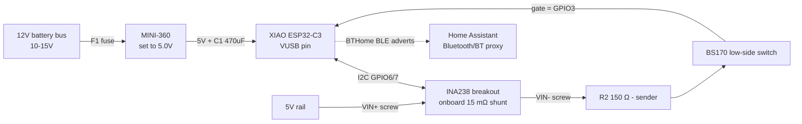
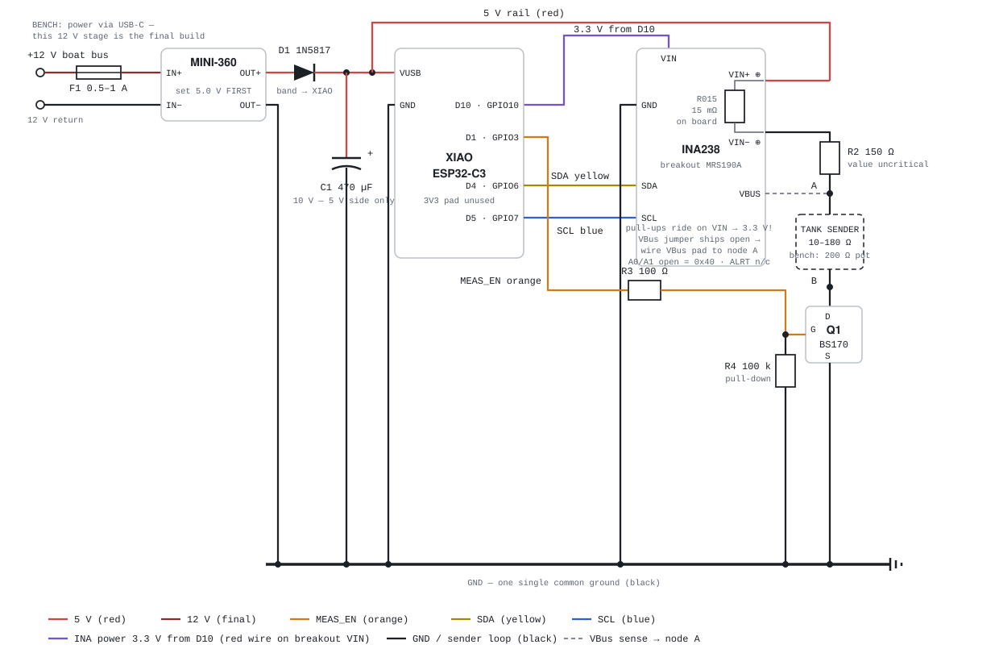

# Hardware — XIAO ESP32-C3 + INA238 tank sensor

Implementation plan for the sensor described in
[concept.md](concept.md), built from the
parts on hand. Target: the fresh water tank on my boat (Kali), VDO-style two-wire **isolated** sender,
European range **~10 Ω (full) … ~180 Ω (empty)**.

> **Rev 2 (2026-09-01):** adapted to the actual INA238 breakout (MRS190A) which has a
> 15 mΩ shunt and screw terminals on board — the external 2.2 Ω shunt is dropped — and to
> a belief that the XIAO's 3V3 pad was not available: the whole measurement path now
> runs from the 5 V rail. (That belief was a mistake — corrected 2026-09-05, the pad is
> free. The 5 V chain is kept anyway: more current through the 15 mΩ shunt means better
> INA238 resolution.) Includes a mandatory I2C level check before first hookup.

## Parts used

| Ref | Part | Role |
|-----|------|------|
| U1 | Seeed XIAO ESP32-C3 | MCU, BLE, deep sleep |
| U2 | INA238 breakout "MRS190A" (addr 0x40) | Measures chain current (onboard 15 mΩ shunt `R015` between screw terminals VIN+/VIN−) and bus voltage |
| U3 | DSN-MINI-360 buck converter | 12 V boat bus → **5.0 V** (final build; bench runs from USB-C) |
| Q1 | BS170 N-channel MOSFET | Low-side switch: measurement path powered only while measuring |
| R2 | 150 Ω ¼ W | Current limit resistor — exact value uncritical (VBus measures after it) |
| R3 | 100 Ω | Q1 gate series resistor |
| R4 | 100 kΩ | Q1 gate pull-down (keeps path off in deep sleep / boot) |
| C1 | 470 µF / 10 V electrolytic | Bulk capacitor on the **5 V** rail (BLE TX bursts; final build) |
| D1 | Schottky diode, e.g. 1N5817/SS14 (**recommended, see note**) | Prevents back-feed into USB when powering via the VUSB pin |
| F1 | Fuse 0.5–1 A | 12 V feed protection (final build) |

Breakout facts (from the board silkscreen): 16-bit, max bus 0–85 V, max ±10 A,
I2C address 0x40 with A0/A1 solder jumpers, two Qwiic-style JST connectors, power LED.

> **The XIAO ESP32-C3 has no on-board antenna — the U.FL pigtail antenna is mandatory,
> on every board.** Without it the radio still "works" at bench range (Wi-Fi at −85 dB,
> BTHome reaching a Raspberry Pi 2 m away at −98 dBm, i.e. 1 dB above the floor), which
> is exactly why it went unnoticed: the M5 trigger failed for a whole evening while both
> firmwares were fine. Antenna on the beacon node alone took its signal from
> "one frame cached at −100 dBm" to a steady −72…−84 dBm at the Pi. Fix the antenna in
> place (hot glue / tape over the U.FL) before potting — it pops off easily.
The "Cut for Low-Side" solder jumper **ships open** on this board (bench-verified: no
continuity, VBus floats and reads 0 V) — the silkscreen is misleading; it's really
"bridge for high-side". Instead of bridging it, the **VBus header pad is wired directly
to node A** (R2/sender junction), which is the better measurement anyway.

## Architecture



The measurement chain (`5 V → VIN+ → R015 (on breakout) → VIN− → R2 → sender → Q1 → GND`)
only conducts while GPIO3 drives the BS170 gate high. In deep sleep the gate is held low
by R4, so the chain draws nothing. The XIAO's 3V3 pad is **not used**.

## I2C logic level — checked: pull-ups sit at VIN

Bench measurement (2026-09-01): with VIN = 5 V the idle SDA/SCL level is **5 V** — the
breakout's pull-ups reference VIN, there is no onboard 3.3 V logic rail, and the
ESP32-C3 is not 5 V tolerant. Therefore the breakout's **VIN is powered from XIAO pin
D10 (GPIO10) at 3.3 V** instead of the 5 V rail:

- INA238 VS range is 2.7–5.5 V → runs fine at 3.3 V, and the pull-ups now idle at 3.3 V.
- Load is ~2–3 mA (INA238 + power LED + pull-up current) — trivial for a GPIO pad.
- **Only the thin VIN wire moves.** The measurement chain stays on 5 V: screw VIN+ is
  still fed from the 5 V rail — the INA238's shunt and VBus inputs tolerate up to 85 V
  independent of VS.
- Bonus: in deep sleep GPIO10 floats → breakout (LED included) is fully off; no
  shutdown-register handling needed.
- D10/GPIO10 chosen because it is unencumbered: not a strapping pin (GPIO2/8/9), not a
  JTAG pin with a reset pull-up (GPIO4–7), and otherwise free.

## Wiring schema

Wire colors below match the actual harness: **red** = 5 V, **black** = GND,
**yellow** = SDA, **blue** = SCL, **orange** = MEAS_EN gate.



### Power supply (final build — the bench runs from USB-C instead)

```
BOAT 12V BUS                    MINI-360 (adjust to 5.0V BEFORE connecting anything!)
============                   ┌──────────────────┐
 +12V ───[F1 0.5–1A]────────── │ IN+         OUT+ │ ──►|── D1 ──┬──────────► XIAO VUSB pin
                               │                  │  (1N5817)   │
  GND ───────────────┬──────── │ IN−         OUT− │ ────────────┼──┬
                     │         └──────────────────┘             │  │
                     │                                     C1 ═╪═  │   470 µF/10 V
                     │                                          │  │   (+) to 5 V side
                     └──────────────────────────────────────────┴──┴──► GND
```

**Warnings**

- **C1 is rated 10 V — 5 V output side only, never the 12 V input.**
- Set the MINI-360 with a multimeter *before* wiring its output. Multi-turn pot,
  arbitrary factory setting.
- D1: the VUSB pin is directly on the USB 5 V net. Feed it through a Schottky so the
  converter can't back-feed the USB port; without a diode, **never connect USB and the
  12 V feed at the same time**.
- Consider a TVS (e.g. SMBJ18A) across the 12 V input for the potted production unit.

### Measurement path and I2C

```
 XIAO D10 (GPIO10, 3.3 V out) ─────────────────────────────────────────► breakout VIN
                                              (logic + I2C pull-ups; off in deep sleep)

 5 V rail (bench: XIAO VUSB pad, USB powered) ── red ──────► screw VIN+ ─┐
                                                                        │ R015 15 mΩ
                                                     (onboard shunt,    │ (on board)
                                                      INA238 measures I)│
                                                            screw VIN− ─┘
                                                                 │
                                                                [R2] 150 Ω
                                                                 │
                                                                 ●─ node A ◄── breakout VBus pad
                                                                 │             (jumper ships open —
                                                                 │              wire it here)
                                                                 │
                                                             ┌───┴────┐
                                                             │ SENDER │ 10–180 Ω two-wire
                                                             └───┬────┘ (bench: 200 Ω pot)
                                                                 │
                                                                 ●─ node B
                                                                 │ D
 XIAO D1 (GPIO3) ── orange ──[R3 100Ω]──● G                   BS170  Q1
                                        │                        │ S
                                       [R4 100k]                 │
                                        │                        │
 GND (black) ───────────────────────────┴────────────────────────┴── XIAO GND, breakout GND

 I2C:
 XIAO D4 (GPIO6) ── yellow ──► breakout SDA ┐  breakout has its own pull-ups —
 XIAO D5 (GPIO7) ── blue ────► breakout SCL ┘  do the level check above first!
 A0/A1 jumpers open = address 0x40 · ALRT not connected
 VBus: internally tied to the shunt via the "Cut for Low-Side" jumper — leave it,
       do not wire the VBus pad.
```

### XIAO ESP32-C3 pin map

| XIAO pin | GPIO | Connects to | Function |
|----------|------|-------------|----------|
| VUSB | — | 5 V rail: screw VIN+ (final: D1 cathode, C1 +) | Supply |
| GND | — | Common ground bus | |
| D1 | GPIO3 | R3 → Q1 gate (orange) | `MEAS_EN` — high = measurement path on |
| D4 | GPIO6 | Breakout SDA (yellow) | I2C data |
| D5 | GPIO7 | Breakout SCL (blue) | I2C clock |
| D10 | GPIO10 | Breakout VIN (red) | `INA_POWER` — 3.3 V supply for the breakout, off in sleep |

GPIO3 is deliberately chosen: not a strapping pin (GPIO2/8/9 are), no JTAG pull-up
quirk (GPIO4–7 have one at reset), and in deep sleep it floats so R4 holds Q1 off.
The 3V3 pad is unused.

## Design rationale

### Resistance measurement: R = V / I

The INA238 measures the chain current through the onboard 15 mΩ shunt and the voltage
at **node A** (the VBus pad is wired there, since the board's VBus jumper ships open).
The firmware computes:

```
R_sender + R_ds(on) = V_bus / I
```

No dependence on rail accuracy or on R2's value; supply sag during BLE activity doesn't
matter. With `MEAS_EN` off, node A rests at ≈ 5 V (no current through R2) — normal.

### Why tolerances (mostly) don't matter

The self-calibration (learned min/max resistance → 0–100 %) absorbs:

- **Shunt tolerance** — pure gain error on I, cancels in the percentage mapping.
- **Q1's R_ds(on)** (≈2–5 Ω at V_GS 3.3 V) — a near-constant offset, cancels in the
  mapping.
- **R2** doesn't appear in the math at all with node-A sensing — its tolerance is
  irrelevant; it only sets the current window.

### The small-shunt caveat (to verify on the bench)

15 mΩ at 15–31 mA gives only ~225–460 µV of shunt signal. Against the INA238's ±5 µV
offset spec that's a worst-case ~2–4 % level error, plus noise (heavy averaging is
configured). For a fresh-water gauge that's acceptable — but **bench task: check reading
stability**; if it disappoints, the lever is more current (smaller R2) before anything
drastic.

### Sizing R2 (150 Ω)

- Limits worst-case current (sender shorted) to `5 V / 153 Ω ≈ 33 mA` — safe for the
  rail and trivial for the BS170 (500 mA).
- Keeps the current window 15–31 mA over the sender range: decent shunt signal, ~140 mW
  peak in R2 (¼ W part, duty-cycled in production).

### INA238 configuration (firmware)

- ADC range **±40.96 mV** (max shunt signal here is < 0.5 mV — always the fine range).
- Long conversions + heavy on-chip averaging; firmware filters further across the 2–3 s
  measurement window. **Constraint (bench-learned):** the full conversion round
  (adc_time × averaging × ~3 channels) must finish inside the update interval, or the
  ESPHome driver restarts the conversion every cycle and never publishes — 1052 µs ×
  128 ≈ 0.4 s works with a 1 s interval; 4120 µs × 128 did not.
- Before deep sleep: drop GPIO10 — the breakout (INA238, pull-ups, LED) is then fully
  unpowered. No shutdown-register handling needed. I2C is open-drain, so the dead bus
  back-powers nothing.

### BS170 low-side switch

- Valid **because the sender is two-wire and isolated**. (A hull-grounded sender would
  need high-side switching instead.)
- **⚠️ Batch pinout warning (bench-verified 2026-09-01):** the BS170s on hand are
  mirrored — flat face toward you they are **S–G–D** (2N7000-style), not the datasheet's
  D–G–S. Installed per datasheet they conduct permanently through the body diode
  (~15 mA with the path off, ~0.66 V across the part). Correct install for this batch:
  **left leg → GND, middle → gate, right leg → node B.** Verify any batch with the
  path-off ≈ 0 mA check before potting.
- V_GS = 3.3 V vs. BS170 threshold spec 0.8–3.0 V: most parts fine, a high-threshold
  specimen may be marginal. **Bench check:** sender terminals shorted → displayed
  resistance ≤ ~5 Ω and stable; otherwise swap in another BS170.
- R4 guarantees the path is off during boot, deep sleep, and firmware crashes.

### Power budget (estimates — verify on the bench)

| State | Draw | Notes |
|-------|------|-------|
| Deep sleep, XIAO | ~44 µA @ 3.3 V | Seeed's figure for the C3 |
| Deep sleep, INA238 shutdown | < 10 µA | |
| Breakout "on" LED | ~1–2 mA while GPIO10 is high | Off in sleep automatically (GPIO-powered breakout) |
| Deep sleep, MINI-360 quiescent | **~0.5–2 mA @ 12 V** | Dominates! Measure it. |
| Active window (~2–3 s per 10 s) | ~25 mA avg, BLE peaks ~80 mA | C1 buffers the peaks |

Rough average: ~3 mA @ 12 V ≈ **70 mAh/day ≈ 2 Ah/month** — acceptable. Biggest levers:
MINI-360 quiescent draw (a low-Iq buck like Pololu D24V5F5 is a drop-in swap), the LED,
wake interval, and active-window length.

**Option: buck to 3.3 V and feed the XIAO's 3V3 pin directly.** The XIAO's on-board LDO
drops 5 → 3.3 V linearly, so while awake it burns (5 − 3.3) V × I_awake — roughly a third
of what the ESP itself uses (≈ 30 mW during the active window, ≈ 10 mW averaged over the
duty cycle, ≈ 1 mA at 12 V, ≈ 25 mAh/day). Real but second-order: the wake interval and
the buck's own quiescent draw each move more. Trade-offs if done: the 5 V rail disappears,
so the measurement chain runs at 3.3 V (currents drop to ~10–20 mA → coarser INA238
resolution; halve R2 to ~68 Ω to compensate — the learned calibration is in Ω and does
not care); disconnect the 3.3 V feed while USB-programming (two supplies in parallel on the
3V3 net); no diode in the 3.3 V line (the C3 needs ≥ 3.0 V under Wi-Fi bursts); keep C1 on
the 3.3 V rail. Feasible on the bench unit as well — its 3V3 pad is free.

## Bench test plan

Bench power: USB-C into the XIAO; the 5 V rail is the VUSB pad. Fake sender: fixed
resistors (10 / 47 / 100 / 180 Ω) or a 200 Ω pot.

**Bench status (2026-09-01):** steps 1–5 done. Findings so far: the FET batch has a
mirrored pinout (see warning above); the onboard shunt behaves like ~17.3 mΩ instead of
15 (readings ~15 % low — pure gain error, absorbed by calibration; a 150 Ω test sender
reads ~130 Ω); USB bench rail measures ~5.27 V via VBus with the path off. Gating
verified: 0 mA off / 20.6 mA on. **Firmware milestone 1 done:** BTHome advertising
works end-to-end — HA discovered "KaliTank" over the Pi's Bluetooth and receives level
(moisture %) and resistance (count ×0.1 Ω). **Milestone 2 done (bench-verified):** the
duty-cycled sleep firmware reports over BTHome at regular intervals with Wi-Fi off,
values track resistor changes, and the INA238 is visibly powered only during
measurement windows. Remaining: accuracy sweep with the real sender, fault cases,
stability.

**Bench status (2026-09-05):** M5 verified end-to-end once the beacon node got its
antenna (see the XIAO note above). The unit now runs from 12 V through the MINI-360 at
~5 V; the quantitative power measurement (sleep vs. active, at the 12 V side) is still open.

1. ~~I2C level check~~ done: pull-ups sit at VIN → breakout VIN rewired to D10 (3.3 V).
2. ~~VBus jumper~~ checked: ships open (VBus read 0 V) → **wire the VBus pad to node A**.
3. **Power**: breakout LED on (fed from D10), 5 V at VUSB / screw VIN+.
4. **I2C**: flash the bench firmware (see [../examples/](../examples/)), check the log finds 0x40.
5. **Switch**: `MEAS_EN` off → ≈ 0 mA, VBus ≈ 5 V (node A rests at the rail); on →
   current flows, VBus drops to the sender voltage.
6. **Accuracy**: compare displayed resistance per the table below and a multimeter;
   verify stability (small-shunt caveat).
7. **Fault cases**: open sender → ≈ 0 mA, VBus → ~5 V → fault; shorted sender →
   ≤ ~5 Ω, VBus ≈ 0.1 V (validates Q1).
8. **Power draw** at 12 V (once the MINI-360 stage is added) in active and sleep states.

Expected values (5.0 V rail, R2 = 150 Ω, R_ds(on) ≈ 3 Ω, VBus at node A, R = V/I):

| Sender R | Chain current | VBus (node A) | Displayed R |
|---------:|--------------:|--------------:|------------:|
| 10 Ω (full) | ~30.7 mA | ~0.40 V | ~13 Ω |
| 47 Ω | ~25.0 mA | ~1.25 V | ~50 Ω |
| 100 Ω | ~19.8 mA | ~2.04 V | ~103 Ω |
| 180 Ω (empty) | ~15.0 mA | ~2.74 V | ~183 Ω |
| open | ~0 mA | → ~5 V | invalid → fault |
| short | ~32.7 mA | ~0.10 V | ~3 Ω (= R_ds) |

A consistent ~3 Ω surplus over the true resistor value is Q1's R_ds(on) — correct, and
absorbed by calibration.

## Firmware roadmap

- **Phase 1 — bench bring-up (now):** plain ESPHome over Wi-Fi, no deep sleep. Validates
  wiring, INA238 readings, the resistance math, and how much filtering/averaging the
  real sender needs. Config lives in [../examples/](../examples/) and was provisioned on
  a HAOS bench Raspberry Pi.
- **Phase 2 — production firmware (in ESPHome, milestone by milestone; port to ESP-IDF
  only if the framework fights back):**
  1. **BTHome advertising, no sleep:** small custom external component (BTHome v2 is one
     BLE service-data blob) added to the bench firmware; verify the HAOS Pi
     auto-discovers it over Bluetooth while Wi-Fi debugging still works.
  2. **Duty cycle** (implemented: `examples/packages/tank-sleep.yaml`, sharing
     `packages/tank-common.yaml` with the bench variant): `deep_sleep` +
     `wifi: enable_on_boot: false`. Timer wake → measure ~2.5 s → a few BTHome
     advertisements with the fresh value → all off → sleep 10 s. **Cold boot
     (power-cycle) opens a 5-minute maintenance window** — Wi-Fi + continuous
     measurement, i.e. bench behavior — used for OTA (and later as the commissioning
     mode on the boat); going back to the bench firmware is power-cycle + OTA within
     the window. Still to measure: real consumption at 12 V (needs the MINI-360 stage).
  3. **Self-calibration + persistence** (implemented: `components/tank_level`):
     median-filtered input, learned min/max with conservative acceptance (a new
     extreme needs 5 observations spaced ≥ 30 s / one per wake, the least extreme
     candidate wins, the range never shrinks, stale candidates decay), seed range
     3–183 Ω used until the learned span reaches 25 Ω, EMA smoothing across wakes in
     RTC memory, implausible readings (< 1 Ω / > 400 Ω / NaN) hold the last good
     level. Calibration + last level persist to NVS flash (writes only on accepted
     extremes or ≥ 2 % level moves — flash-wear-safe) and survive power cycles *and*
     firmware variant swaps. Kali's sender: **low R = empty** → direct mapping
     (`invert` option exists for VDO-style senders). To wipe learned calibration:
     USB-flash with flash erase, or bump the preference key in `tank_level.cpp`.
  4. **Tank content model** (implemented; values pending the on-site pump test): float
     senders have a bottom dead zone — Kali's sender saturates at ~4.5 Ω over its
     lowest cm and sits above unmeasured tank volume. `reserve_volume` (liters the pump
     still delivers after measured 0 %) and `total_volume` rescale the published level
     to true content (bottoms out at the reserve fraction instead of a false 0 %), add
     a **Tank volume** sensor in liters (BTHome volume object, 0.1 L) and a **Tank
     almost empty** problem-class binary (BTHome binary object) that trips when the
     float sits on its bottom stop and the reserve drains unmeasured. Defaults 0/0 =
     previous behavior. On-site procedure: drain until the gauge reads its floor, count
     liters until the pump struggles → that's `reserve_volume`.
  5. **BLE-triggered OTA** — both ends implemented; end-to-end test pending hardware.
     The trigger is a standard **iBeacon** frame (project UUID, major 0x4B4F "KO",
     minor 0x54<target>). While awake the sensor scans (~94 % listen duty) and matches
     on major/minor via ESPHome's native iBeacon parser (byte-order unambiguous — the
     UUID is only for display); a match opens the same 5-minute maintenance window as
     a cold boot (Wi-Fi + OTA + live measurement), then it sleeps again.
     **Transmitter: a second XIAO** (`examples/ota-trigger-beacon.yaml`, custom
     `components/ota_beacon`) — required because ESPHome's built-in `esp32_ble_beacon`
     has no runtime on/off and would advertise forever, making the sensor open Wi-Fi
     every wake. Idle by default; an HA switch advertises for 4 min with a 6 min
     firmware backstop. **Bonus of the iBeacon choice: HA's iBeacon integration shows
     the trigger as present while it's on air** — free proof it's transmitting.
     **Bench finding (2026-09-04): the HA host's own radio cannot be the transmitter** —
     HAOS BlueZ refuses `RegisterAdvertisement` (`org.bluez.Error.Failed`) even on the
     idle hci1, because HA's Bluetooth integration owns the adapters; `btmgmt` isn't
     shipped, and freeing the adapter would kill BTHome reception. The beacon node
     doubles as an ESPHome Bluetooth proxy if HA needs better reception.
- **Phase 3 — helpers & install:** OTA-trigger transmitter (HA-host BLE if milestone 4
  proves it, else a second XIAO), optionally an ESPHome Bluetooth proxy, enclosure +
  potting (LED removed, correct-pinout FET verified), install on the fresh water tank.

## Open questions

- Reading stability with the 15 mΩ onboard shunt at 15–30 mA (small-shunt caveat).
- BS170 specimen threshold check.
- MINI-360 real-world quiescent current at 12 V.
- Sampling time needed per cycle for a stable reading with sloshing.
- Long sender wiring runs: may warrant 100 nF across the sender terminals / ESD
  clamping at node A for the potted unit.
